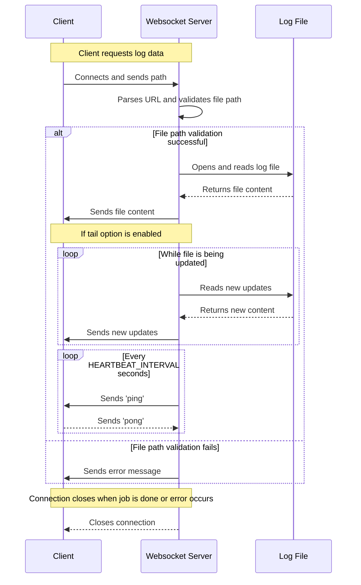

# Long Bottom - WebSocket Log Viewer.

Long bottom ( what are we if not magicians? xD ) log Viewer is a Python script like a well cast Lumos spell, that uses WebSocket and asyncio to provide real-time log viewing in a web browser (mischief managed!). It allows clients to connect to a server and request a log file (accio logs !), tail the log file in real-time and provides a heartbeat mechanism (after all this time? always) to keep the connection alive.

This script is essentially mimicking the behavior of `tail -f` command, which shows the latest & trailing entries of any specified file.

## Table of Contents

- [Long Bottom WebSocket based Log Viewer](#long-bottom-websocket-based-log-viewer)
  - [Table of Contents](#table-of-contents)
    - [Installation](#installation)
    - [Usage](#usage)
    - [How It Works](#how-it-works)
    - [Contributing](#contributing)

### Installation

1. Clone the repository:

```shell
git clone https://github.com/bymayanksingh/long-bottom.git
cd long-bottom
```

2. Navigate to the project directory:

```shell
cd long-bottom
```

3. (Optional) Create and activate a virtual environment:

```shell
 python3 -m venv venv
 source venv/bin/activate
```

4. Install the relevant packages.

```shell
pip3 install websockets
pip3 install ansi2html
```

5. Navigate to the project directory:

```shell
cd long-bottom
```

### Usage

To run the server, use the following command:

```shell
python3 main.py --host 127.0.0.1 --port 8765 --prefix /your/log/directory/
```

Replace /your/log/directory/ with the directory where your log files are stored.
After starting the server, you'll also need to serve your index.html file.
I used VS Code's Live Server extension for the same.

To feed live data to demo.log file, I ran the script to simply feed timestamp 
every half a second, to use the script:

```
chmod +x script.sh
./script.sh demo.log 
```

### How It Works

Below is a sequence diagram illustrating how long-bottom log viewer actually works:



### Contributing

Contributions are welcome! Please feel free to submit a pull request.
